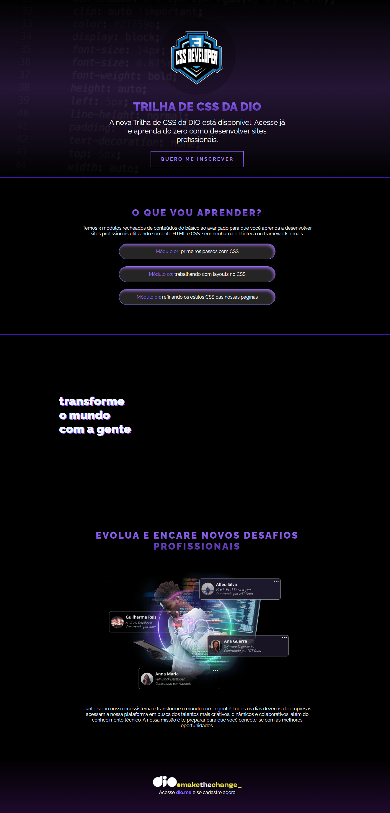

# Desafio 01: Criando minha primeira Landing Page com HTML e CSS

Bem vindo(a) ao primeiro desafio da Trilha de CSS da DIO! Nela, eu construir minha primeira Landing Page com HTML e CSS, colocando em prática os fundamentos do CSS,
as propriedades básicas da linguagem de estilização, além de trabalhar com as unidades de medidas relativas e absolutas que aprendemos ao longo da trilha.

[Clique aqui](https://micheleambrosio.github.io/dio-trilha-css-desafio-01/) para acessar o resultado final da Landing Page criada a partir do desafio!

## 🛠 Tecnologias

- HTML
- CSS 

# 📞Contato
 
> Email: douglasfernandesti@gmail.com

> Whatsapp: (85) 989712043 

> Insta: @_dougl4z
